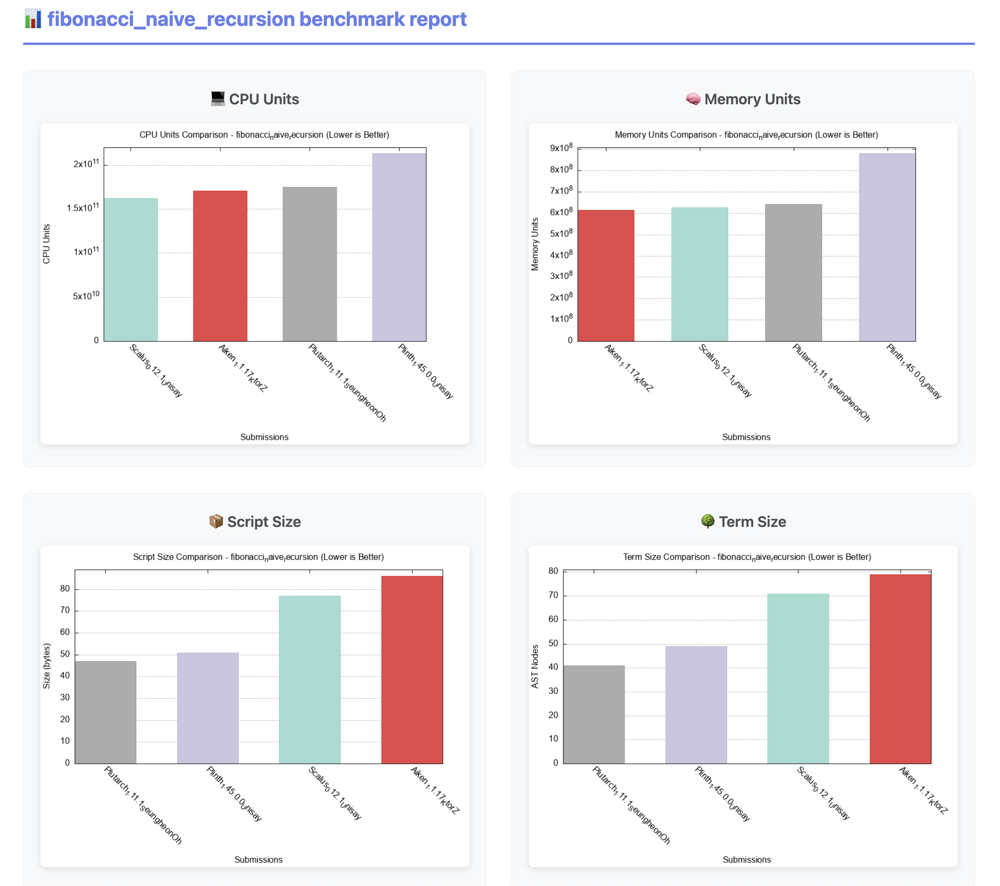

# Scalus — Catalyst Fund 11 Project Close‑out Report

## Scalus – multiplatform Scala implementation of Cardano Plutus

[Catalyst Project Link](https://projectcatalyst.io/funds/11/cardano-open-developers/scalus-multiplatform-scala-implementation-of-cardano-plutus)

## Project Number

1100252

## Project Manager

Alexander Nemish

## Dates

* **Start:** 2024‑03‑11
* **Completion:** 2025‑10‑14

---

## Project Description

[Scalus](https://scalus.org) is a Scala implementation of Cardano Plutus, PlutusTx, including UPLC
evaluation machine and built‑ins for V1 and V2.

It allows developers to write Cardano smart contracts using [Scala 3](https://scala-lang.org/)
programming language.

Scalus leverages Scala compiler plugin system and macros to convert Scala code to Cardano Untyped
Plutus Core (UPLC), similarly to how Plutus converts Haskell to UPLC.

It also provides a full‑featured UPLC parser, pretty‑printer, and an evaluation engine that can run
on multiple platforms: JVM (Java, Kotlin, etc.), JavaScript (Node.js, browsers), and even Native (
C/C++/Rust, etc.) via LLVM backend.

---

## Project KPIs • How We Addressed Them

| Project KPI                                                                 | Outcome                                                                                                                                      |
|-----------------------------------------------------------------------------|----------------------------------------------------------------------------------------------------------------------------------------------|
| **Scala to UPLC compiler**                                                  | Huge amount of unit tests, Scalus Standard library code and real smart contracts like Hydrozoa, Binocular, Cosmex and AdaStream              |
| **Full Plutus V1/V2 CEK Coverage**                                          | 100 % of V1 & V2 built‑ins + cost models implemented; V3 core delivered ahead of schedule                                                    |
| **Cross‑Platform Reach** Make tooling available beyond Haskell ecosystem | One codebase ships as JVM JAR, JavaScript ESM/NPM package, and Native C‑ABI library (Key Achievements #2)                                    |
| **Script Budget Accuracy**                                                  | Verified against 100k mainnet scripts with exact budget match                                                                                |
| **Packaging & Documentation**                                               | 12+ tagged releases to Maven Central & NPM, Scalus Starter Project, full API docs, site with documentation and tutorials                     |
| **Community Uptake**                                                        | 100 ★ on GitHub, >50 Discord members, 18 contributors; integrations with leading JS SDKs (Key Achievements #4 & #5)                          |
| **Ecosystem Collaboration** Demonstrate real‑world adoption              | Library already powers **Binocular** oracle & **Hydrozoa** mini‑Hydra; Lucid Evolution & Mesh.JS integrations underway (Key Achievements #4) |

---

## Key Achievements

1. **Scala to UPLC Compiler** – Developed Scala 3 compiler backend to translate Scala code
   to UPLC, enabling writing Plutus contracts in Scala. 
   [UPLC CAPE benchmarks](https://intersectmbo.github.io/UPLC-CAPE/benchmarks/fibonacci_naive_recursion.html)
   show Scalus‑generated UPLC is on par with and even better than Plinth/Aiken/Plutarch.
   
2. **Complete CEK & Built‑ins** – Implemented Plutus V1 & V2 virtual machines, built‑ins, cost
   models, UPLC parser & pretty‑printer entirely in Scala 3.
3. **Triple‑Target Build** – Single codebase compiles to JVM (JAR), JavaScript (NPM/ESM via
   Scala.js) and Native shared library (Scala Native + LLVM).
4. **Deterministic Budget Validation** – Replayed ≈100,000 mainnet scripts; Scalus results matched
   the reference node *byte‑for‑byte* for both outcome and budget.
5. **Ecosystem Integration** – Scalus already underpins the **Binocular** optimistic Bitcoin oracle
   and the [**Hydrozoa**](https://github.com/cardano-hydrozoa/hydrozoa) improved Hydra‑like state
   channels protocol prototype; active work to embed
   the JS library into **Lucid Evolution** and **Mesh.JS** SDKs.
6. **On‑boarding & Community** – Published Scalus Starter Project, full API site, Discord support,
   CI‑driven release flow to Maven Central & NPM; project has ~100 GitHub stars and several external
   contributors.
7. **V3 Support** – Delivered core UPLC V3 support ahead of schedule, including CEK updates and
   built‑ins.

These milestones collectively make Scalus the only end‑to‑end, full-stack, multiplatform Cardano
DApp development platform.

---

## Key Learnings

* A rigorously limited, platform‑agnostic subset of Scala 3 can faithfully mirror Plutus semantics
  while maintaining readable, idiomatic code.
* Cross‑compiling to three targets from one codebase is achievable with careful boundary
  abstractions and continuous integration testing.
* Early usage of Scalus for full-fledged DApps (Binocular, Cosmex, AdaStream, Hydrozoa) surfaced
  edge‑cases sooner and materially improved library robustness.

---

## Next Steps

* Plutus V4 support, including new built‑ins and cost models.
* Improved developer experience and documentation, including more tutorials and examples.
* Explore funding for formal verification of the CEK implementation
  using [Stainless](https://epfl-lara.github.io/stainless/intro.html).

---

## Final Thoughts

Catalyst funding transformed an experimental prototype into production‑ready infrastructure adopted
by multiple projects in less than 15 months. We will continue to drive Scalus forward as the
de‑facto full‑stack platform for Cardano DApps.

---

## Resources

* GitHub • [https://github.com/nau/scalus](https://github.com/nau/scalus)
* Docs • [https://scalus.org/api/index.html](https://scalus.org/api/index.html)
* Starter • [https://github.com/lantr-io/scalus-starter](https://github.com/lantr-io/scalus-starter)
* Discord • [https://discord.gg/ygwtuBybsy](https://discord.gg/ygwtuBybsy)
* Multiplatform evaluation & budgeting
  demo: [https://youtu.be/A8MQsGn5XFo](https://youtu.be/A8MQsGn5XFo)

## Close‑out Video

[Public demo of multiplatform evaluation & budgeting](https://www.youtube.com/watch?v=AlzYO5OLwBU)
