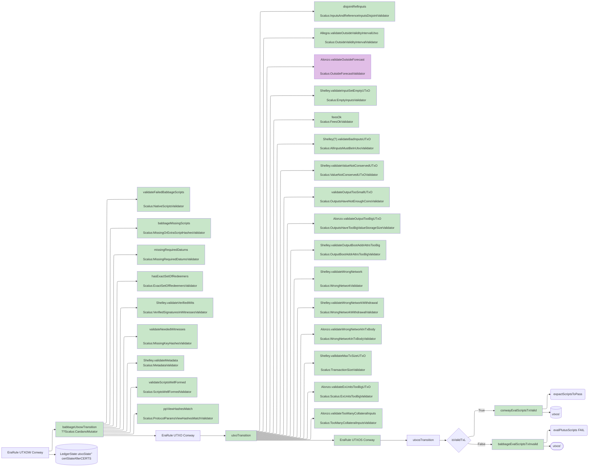

## EraRule UTXOW - validating and updating UTxO state

This EraRule is responsible for validating and updating the UTxO state.

Implementation progress:

```mermaid
---
config:
  
  layout: elk
---
flowchart LR
EUC[EraRule UTXOW Conway]
    EUC --> babbageUtxowTransition["babbageUtxowTransition
                                    ??Scalus:CardanoMutator"]:::done
        babbageUtxowTransition --> validateFailedBabbageScripts["validateFailedBabbageScripts
                                                                Scalus:NativeScriptsValidator"]:::done
        babbageUtxowTransition --> babbageMissingScripts["babbageMissingScripts
                                                        Scalus:MissingOrExtraScriptHashesValidator"]:::done
        babbageUtxowTransition --> missingRequiredDatums["missingRequiredDatums
                                                        Scalus:MissingRequiredDatumsValidator"]:::done
        babbageUtxowTransition --> hasExactSetOfRedeemers["hasExactSetOfRedeemers
                                                        Scalus:ExactSetOfRedeemersValidator"]:::done
        babbageUtxowTransition --> validateVerifiedWits["Shelley.validateVerifiedWits
                                                        Scalus:VerifiedSignaturesInWitnessesValidator"]:::done
        babbageUtxowTransition --> validateNeededWitnesses["validateNeededWitnesses
                                                            Scalus:MissingKeyHashesValidator"]:::done
        babbageUtxowTransition --> validateMetadata["Shelley.validateMetadata
                                                    Scalus:MetadataValidator"]:::done
        babbageUtxowTransition --> validateScriptsWellFormed["validateScriptsWellFormed
                                                    Scalus:ScriptsWellFormedValidator"]:::done
        babbageUtxowTransition --> ppViewHashesMatch["ppViewHashesMatch
                                                    Scalus:ProtocolParamsViewHashesMatchValidator"]:::done
        babbageUtxowTransition --> EUTXOC[EraRule UTXO Conway]
            EUTXOC --> utxoTransition:::done
                utxoTransition --> disjointRefInputs["disjointRefInputs
                                                    Scalus:InputsAndReferenceInputsDisjointValidator"]:::done
                utxoTransition --> validateOutsideValidityIntervalUtxo["Allegra.validateOutsideValidityIntervalUtxo
                                                                        Scalus:OutsideValidityIntervalValidator"]:::done
                utxoTransition --> validateOutsideForecast["Alonzo.validateOutsideForecast
                                                            Scalus:OutsideForecastValidator"]:::question
                utxoTransition --> validateInputSetEmptyUTxO["Shelley.validateInputSetEmptyUTxO 
                                                            Scalus:EmptyInputsValidator"]:::done
                utxoTransition --> feesOk["feesOk
                                        Scalus:FeesOkValidator"]:::done
                utxoTransition --> validateBadInputsUTxO["Shelley(?).validateBadInputsUTxO
                                                        Scalus:AllInputsMustBeInUtxoValidator"]:::done
                utxoTransition --> validateValueNotConservedUTxO["Shelley.validateValueNotConservedUTxO
                                                        Scalus:ValueNotConservedUTxOValidator"]:::done
                utxoTransition --> validateOutputTooSmallUTxO["validateOutputTooSmallUTxO
                                                            Scalus:OutputsHaveNotEnoughCoinsValidator"]:::done
                utxoTransition --> validateOutputTooBigUTxO["Alonzo.validateOutputTooBigUTxO
                                                           Scalus:OutputsHaveTooBigValueStorageSizeValidator"]:::done 
                utxoTransition --> validateOutputBootAddrAttrsTooBig["Shelley.validateOutputBootAddrAttrsTooBig
                                                                    Scalus:OutputBootAddrAttrsTooBigValidator"]:::done
                utxoTransition --> validateWrongNetwork["Shelley.validateWrongNetwork
                                                        Scalus:WrongNetworkValidator"]:::done
                utxoTransition --> validateWrongNetworkWithdrawal["Shelley.validateWrongNetworkWithdrawal
                                                                Scalus:WrongNetworkWithdrawalValidator"]:::done
                utxoTransition --> validateWrongNetworkInTxBody["Alonzo.validateWrongNetworkInTxBody
                                                                Scalus:WrongNetworkInTxBodyValidator"]:::done
                utxoTransition --> validateMaxTxSizeUTxO["Shelley.vallidateMaxTxSizeUTxO
                                                                Scalus:TransactionSizeValidator"]:::done
                utxoTransition --> validateExUnitsTooBigUTxO["Alonzo.validateExUnitsTooBigUTxO 
                                                            Scalus:Scalus:ExUnitsTooBigValidator"]:::done
                utxoTransition --> validateTooManyCollateralInputs["Alonzo.validateTooManyCollateralInputs
                                                                Scalus:TooManyCollateralInputsValidator"]:::done
                utxoTransition --> EUTXOSC[EraRule UTXOS Conway]:::done
                    EUTXOSC --> utxosTransition
                utxosTransition --> isValidTxL{isValidTxL}
                    isValidTxL --> |True| conwayEvalScriptsTxValid:::done
                        conwayEvalScriptsTxValid --> expectScriptsToPass(expactScriptsToPass)
                        conwayEvalScriptsTxValid --> conwayEvalScriptsTxValidUtxosPrime[(utxos')]
                    isValidTxL --> |False| babbageEvalScriptsTxInvalid:::done
                        babbageEvalScriptsTxInvalid --> evalPlutusScripts(evalPlutusScripts FAIL)
                        babbageEvalScriptsTxInvalid --> babbageEvalScriptsTxInvalidUtxosPrime([utxos'])
    EUC --> LedgerState[(LedgerState utxoState'' certStateAfterCERTS)]

    classDef todo  fill:#FFCDD2
    classDef wip  fill:#FFE0B2
    classDef question fill:#E1BEE7
    classDef done  fill:#C8E6C9
```

